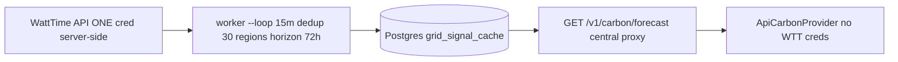

# CarbonSight

**Pick a lower-carbon + cheaper AWS spot region under deadline** — using [WattTime](https://www.watttime.org/) marginal emissions (MOER), power model, and spot lifetime.

This is **not** certified LCA/offsets — operational electricity estimate only.

## Why: carbon, time, cost are all heterogeneous

Cloud GPU spot price varies 5× by region + hour, lifetimes heavy-tailed (15min vs 20h), MOER varies 3× by region + diurnal. CarbonSight now does joint rank:

```
U = V(t) * η - C_total - E/Lbar
C_total = spot $/hr + carbon kg/hr/1000 * price_per_ton
η = (Lbar - d)/Lbar ,  V(t)=C_od·θ/θ̃ ,  E = egress $/GB * ckpt
```

- **Time:** deadline pressure θ=(P-p)/(T-t), future value V, effectiveness η after cold start d, predicted lifetime Lbar, safety-net T-t<P-p+2d
- **Cost:** spot $/hr vs OD $/hr via Protocol (static fallback or dynamic boto3 wrapper), migration E/Lbar
- **Carbon:** MOER lb/MWh windowed [t,t+Lbar] not point now, kg/hr via power model, monetized via social cost

Paper: SkyNomad arXiv:2601.06520 — multi-region spot cost under deadline. We extend it with carbon lever from WattTime.

## One WattTime credential for everyone

Old: every CLI needed `WATTTIME_USERNAME`. New: central cache.



- `watttime/cache.py:71` ForecastCache TTL 15min, `get_time_weighted_moer(mixture,start,end)` reuses clipping logic
- `providers/carbon.py:250` factory: `CARBONSIGHT_API_URL` → Api (no creds) > `WATTIME_USERNAME` → WattTime + cache (ONE cred) > synthetic 400
- `routes/carbon.py:180` central proxy + DB optional, `routes/recommendations.py:49` returns 17 rows even without creds via synthetic
- Worker `fetch_watttime.py:44` single writer, 30 calls/15min << 3000/5min limit

**No creds needed to try:**
```bash
CARBONSIGHT_API_URL=http://127.0.0.1:8000 carbonsight advise --yaml examples/skypilot/train.yaml --json
# → 17 rows via central cache
```

## Quick start

```bash
cd carbonsight
uv sync --extra dev --extra api  # or pip install -e .
```

### 1D advise (existing)

```bash
carbonsight advise --yaml examples/skypilot/train.yaml --json
# → greenest-first within --max-cost-premium 20%
```

### Joint 2D schedule (NEW, live without WattTime creds)

```bash
.venv/bin/carbonsight schedule --yaml tests/fixtures/train_minimal.yaml \
  --deadline-hours 45 --checkpoint-size-gb 100 --carbon-price 50 --json | head -n 30
```

<details><summary>Table output (rank by utility U, higher better)</summary>

```
Rank Region      Mode Lbar η    $/hr kgCO2/hr carbon $/hr C_total E/Lbar   U   V
1 us-east-1   spot 12.0 0.97 $1.43 0.144   $0.007     $1.44 $0.00 2.56 4.10
2 us-west-2   spot 10.0 0.97 $1.43 0.144   $0.007     $1.44 $0.20 2.34
... idle U=0, OD U=V-C
Top action: Launch us-east-1 spot if U>0 else idle, Δ=0.05 anti-flap
Safety-net: --deadline-hours 1 triggers OD us-east-1
```

</details>

```bash
# Safety net example: tight deadline T=1h < P+2d=1.2h → forces OD
carbonsight schedule --yaml ... --deadline-hours 1 --json
# {"action":"safety_net_on_demand","chosen_region":"us-east-1"}

# Multi-lever flip: price=0 → cheapest wins, high price → green wins
# stub test: EU 150 MOER $4/hr vs US 420 MOER $3/hr, flip at 20000 $/ton
```

### API + worker (prod)

```bash
docker-compose -f carbonsight/infra/docker/docker-compose.yml up -d
# db + api:8000 (WATTIME_USERNAME env ONE cred) + worker loop 15m upserts grid_signal_cache

curl http://127.0.0.1:8000/health
curl http://127.0.0.1:8000/v1/regions | jq length # 21
curl "http://127.0.0.1:8000/v1/carbon/forecast?wt_region=PJM_DC" | jq .source
curl -X POST http://127.0.0.1:8000/v1/recommendations -d '{"gpu_type":"A100"}' | jq length # 17 even without creds
```

## Validate without WattTime creds (vibe-coding)

```bash
WATTTIME_USERNAME= uv run pytest tests/unit/test_central_cache_stub.py -v
# 5 passed: night MOER 150 < day 420, mixture 140, API 21→17 recs, green vs dirty flip

uv run pytest tests/unit -v # 191 passed
```

## File map (short)

| What | Where |
|------|-------|
| WattTime client + token + 429 | `watttime/client.py:26` |
| Central cache TTL + window | `watttime/cache.py:71` |
| Carbon providers single-cred | `providers/carbon.py:250` factory |
| Spot price isolated | `providers/spot.py:26` Protocol, `unified_model.py:55` Static read-only |
| Availability probing Sec 4.3 | `spot/availability.py:105` |
| Lifetime Nelson-Aalen Sec 4.4 | `spot/lifetime.py:80-310` h=e/n, S=exp(-H), Lbar |
| Progress V(t) Sec 4.5 | `spot/progress.py:44` θ, V=C_od·θ/θ̃, thrifty, safety-net |
| Utility U Sec 4.6 | `spot/unified_model.py:258` U=V·η - C_total - E/Lbar |
| Joint schedule live | `commands/schedule.py:40` |
| Central API + worker | `routes/carbon.py:180`, `worker/fetch_watttime.py:44` |
| Config | `config.py:21` CARBONSIGHT_API_URL etc |

More: [ARCHITECTURE.md](ARCHITECTURE.md) (with line pointers), [CURRENT_STATE.md](CURRENT_STATE.md), [IMPLEMENTATION_PLAN.md](IMPLEMENTATION_PLAN.md)

## Contributing

Keep domain logic in `carbonsight_core`, one ranking path for CLI+API. No secrets in repo.

## License

MIT
